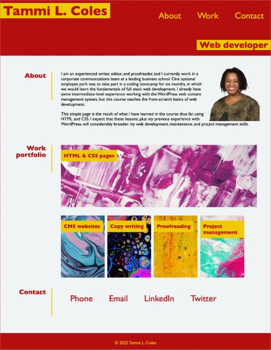

# 02-Advanced-CSS-Portfolio

## About the project
Homework assignment of the ESMT Coding Bootcamp Challenge to create a responsive portfolio page with HTML and CSS
## Screenshot

## Changelog
* Create index.html information architecture
* Fill in dummy content and placeholder images
* Import reset stylesheet
* Create styles for desktop 
* Test and correct styles for responsive layout
* Update content and images with real content
* Correct errors in CSS flex display (column, row, and wrap issues)

## Special challenges for further study
* Flexbox grow, shrink, and basis
* Clear: both/left/right;
* Div background image

## Contact
Tammi L. Coles  
Project link: https://github.com/tlcoles/02-Advanced-CSS-Portfolio  
Working copy: https://tlcoles.github.io/02-Advanced-CSS-Portfolio/  

## Cont
